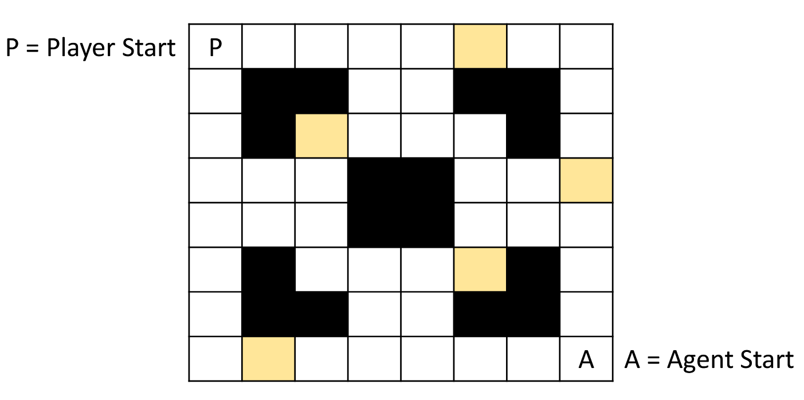

# Heuristic - Chase vs Flee
## Rules of the Game
### Player Objectives
1. Player must visit all squares (exception walls), while avoiding getting touched by Agent.
2. Player can kill the agent for x seconds by using a power-up.
3. Power-Up lasts y seconds or until Agent is killed.

### Agent Objectives
1. Catch the Player
2. Avoid getting Killed

### Map
1. The World consists of an 8x8 Grid
2. The world has walls (Black) and Power Ups (Yellow)
3. Manhattan distance `Dist = |x1-x2| + |y1-y2|` (maximum 14).

(0=free, 1=wall, 2=power‑up):
```python
world = [
    [0,0,0,0,0,2,0,0],
    [0,1,1,0,0,1,1,0],
    [0,1,2,0,0,0,1,0],
    [0,0,0,1,1,0,0,2],
    [0,0,0,1,1,0,0,0],
    [0,1,0,0,0,2,1,0],
    [0,1,1,0,0,1,1,0],
    [0,2,0,0,0,0,0,0]
]
```



## Objective is to Develop a Chase or Flee Heuristic

### What I want you to do:
1. Choose 3 to 5 features for this heuristic
2. Normalize each feature (how would you do that)
3. Propose weights [0,1] → Explain your reasoning
4. Write your formula and “test it” using different coordinates for the player and the agent
Experiment with 3 or 4 different coordinate combinations

### 1. Features
1. `D_player` = Distance to Player - *Reward*
2. `D_wall` = Distance to Nearest Wall - *Reward*
3. `PU_active` = Power-Up Status (Active/Inactive) - *Cost*
4. `D_player_to_PU` = Player is ≤ 2 tiles from a Power-Up - *Cost*
 

### 2. Normalization
1. Distance to Player: Normalize by dividing by the maximum possible distance in the grid (which is 14 for an 8x8 grid). `d_player = 1 - (D_player / 14)`
2. Distance to Nearest Wall: Normalize by dividing by the maximum possible distance in the grid (which is 14 for an 8x8 grid). `d_wall = D_wall / 14`
3. Power-Up Status: Binary feature (1 if active, 0 if inactive). `pu = PU_active`
4. Player Distance to Nearest Power-Up: Normalize by dividing by the maximum possible distance in the grid (which is 14 for an 8x8 grid). `near_pu = 1 if D_player_to_PU ≤ 2 else 0`

*(all in [0,1])*


### 3. Weights
1. `w_player = 0.6` (Most important for chase/flee behavior)
2. `w_wall = 0.2` (Important for navigation)
3. `w_pu = 0.3` (Critical for decision-making)
4. `w_p2pu = 0.6` (Strong penalty if player is right next to power-up)

Bias: `b = 0.2`

### 4. Formula
Reward = `w_player*d_player + w_wall*d_wall + b`  
Cost   = `w_pu*pu + w_p2pu*near_pu + b`  
Desirability = `Reward - Cost`  
Decision: `Chase` if Desirability > 0, else `Flee`.

| (Px,Py) | (Ax,Ay) | (WAx,WAy) | (CPUx,CPUy) | d_player     | d_wall       | pu | near_pu      | Reward              | Cost             | Desirability     | Decision |
|:--------:|:------:|:---------:|:-----------:|:------------:|:------------:|:--:|:-----------:|:--------------------|:-------------------|:-------------------:|:--------:|
| (0,0) | (7,7) | (6,6) | (2,2) | 1-(14/14)=0 | 2/14=0.14 | 0 | 4(0) | 0x0.6+0.14x0.2+0.2=0.23 | 0x0.3+0x0.6+0.2=0.2 | 0.23-0.2=0.03 | **Chase** |
| (0,0) | (7,7) | (6,6) | (2,2) | 1-(14/14)=0 | 2/14=0.14 | 1 | 4(0) | 0x0.6+0.14x0.2+0.2=0.23 | 1x0.3+0x0.6+0.2=0.5 | 0.23-0.5=-0.27 | **Flee** |
| (7,0) | (6,4) | (6,5) | (5,0) | 1-(5/14)=0.64  | 1/14=0.07 | 1 | 2(1) | 0.64x0.6+0.07x0.2+0.2=0.6 | 1x0.3+1x0.6+0.2=1.1 | 0.6-1.1=-0.5 | **Flee** |
| (0,7) | (2,7) | (2,6) | (1,7) | 1-(2/14)=0.86 | 1/14=0.07 | 0 | 1(1) | 0.86x0.6+0.07x0.2+0.2=0.73 | 0x0.3+1x0.6+0.2=0.8 | 0.73-0.8=-0.07 | **Flee** |

**Column legend:**
- `(Px,Py)`: coordinates of the **Player**.
- `(Ax,Ay)`: coordinates of the **Agent**.
- `(WAx,WAy)`: coordinates of the closest **Wall** to the Agent.  
- `(CPUx,CPUy)`: coordinates of the **Closest Power-Up** to the Player.  
- `near_pu`: 1 if `Manhattan(Player, CPU) ≤ 2`, otherwise 0.  
- All distances (`d_player`, `d_wall`, `near_pu`) are calculated using **Manhattan distance**:  
  \[
  D = |x_1 - x_2| + |y_1 - y_2|
  \]
- `Reward`: `d_player * w_player + d_wall * w_wall + b`
- `Cost`: `pu * w_pu + near_pu * w_p2pu + b`
- `Desirability`: `Reward - Cost`